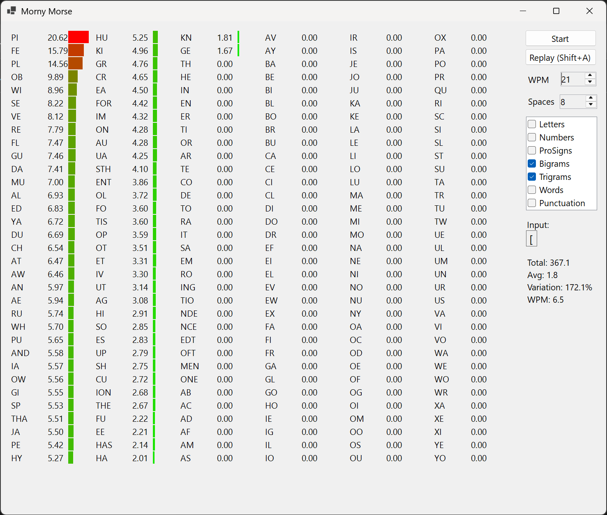

MornyMorse

This is a pretty basic app designed to not get in the way and help you learn Morse.  You just choose what you want to be tested on.
When you click start, it will pick something and play it, and you have to type what you hear.  
You can Replay or hit SHIFT-A to hear it again.  If you get a character wrong, you'll get a beep and you have to type the current played thing again.
You can select WPM for the characters and WPM for the spaces.

Accepted wisdom for learning faster morse is to play the letters, up over 20WPM so you start to learn the whole 'sound' of the letters, instead of individual dots/dashes; and leave bigger gaps to give you thinking time.  Try setting 20WPM and 4WPM spaces, and go from there - adjusting the spaces up until you can copy at the same rate.

There aren't really reset options, and the timings are whatever you are currently doing.  Just let it play.  The advantage of this app over others is that it doesn't keep stopping, waiting for you to click stuff.  You hear it, you type it, repeat until you are bored.

There is also an --autostart option which will make the app play the moment it begins.

The last settings are remembered; so the app should start as you left it.  This was thrown together pretty quickly.  Don't expect a production quality experience....  In particular, you might need to make the window bigger; it isn't smart about laying out the current results.

